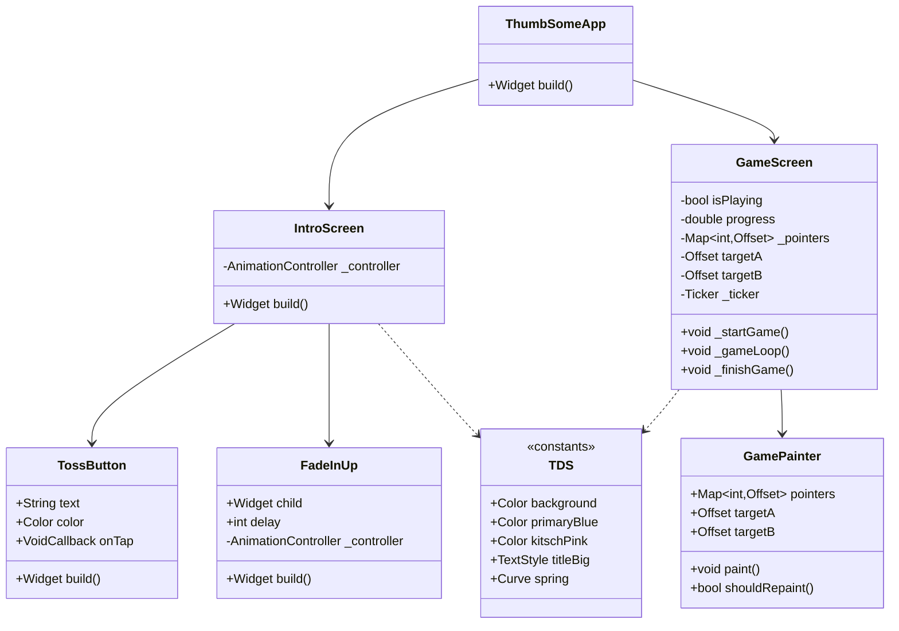

# ARCHITECTURE.md - System Architecture Design

---
title: 썸썸 (Thumb Some) - System Architecture
version: 1.0.0
status: Approved
owner: @development-team
created: 2025-12-01
updated: 2025-12-01
reviewers: [@lead-developer, @architect]
---

## 변경 이력 (Changelog)

| 버전 | 날짜 | 작성자 | 변경 내용 |
|------|------|--------|----------|
| 1.0.0 | 2025-12-01 | @development-team | 최초 작성 |

## 관련 문서

- [CONTEXT.md](../../CONTEXT.md) - Project Context
- [PRD.md](../../PRD.md) - Product Requirements
- [API_SPEC.md](./API_SPEC.md) - API Specification
- [DATA_MODEL.md](./DATA_MODEL.md) - Data Model
- [FRONTEND_SPEC.md](./FRONTEND_SPEC.md) - Frontend Specification

---

## 📑 Table of Contents

1. [System Overview](#system-overview)
2. [Architecture Evolution](#architecture-evolution)
3. [Current Architecture (MVP)](#current-architecture-mvp)
4. [Target Architecture (Phase 2)](#target-architecture-phase-2)
5. [Component Structure](#component-structure)
6. [Data Flow](#data-flow)
7. [State Management](#state-management)
8. [Dependency Management](#dependency-management)
9. [Performance Architecture](#performance-architecture)
10. [Security Architecture](#security-architecture)
11. [Migration Strategy](#migration-strategy)
12. [Architecture Decision Records](#architecture-decision-records)

---

## 1. System Overview

### 1.1 System Context

```mermaid
C4Context
    title System Context Diagram - 썸썸 (Thumb Some)

    Person(user, "User", "20-30대 썸 타는 사용자")

    System(app, "썸썸 App", "멀티터치 기반<br/>소셜 게임 앱")

    System_Ext(firebase, "Firebase", "Analytics, Crashlytics,<br/>Remote Config")
    System_Ext(appstore, "App Store", "iOS 배포")
    System_Ext(playstore, "Play Store", "Android 배포")

    Rel(user, app, "플레이", "Multi-touch")
    Rel(app, firebase, "이벤트 전송,<br/>설정 가져오기", "HTTPS")
    Rel(app, appstore, "다운로드", "HTTPS")
    Rel(app, playstore, "다운로드", "HTTPS")
```



### 1.2 High-Level Architecture

**Current (MVP)**:
```
┌─────────────────────────────────────┐
│         Flutter App                 │
│  ┌───────────────────────────────┐  │
│  │      main.dart (599 lines)    │  │
│  │  - UI (IntroScreen, GameScreen)│  │
│  │  - Logic (Game physics)       │  │
│  │  - Graphics (CustomPainter)   │  │
│  │  - State (setState)           │  │
│  └───────────────────────────────┘  │
└─────────────────────────────────────┘
         ↓
    Platform APIs
    (Haptic, Canvas)
```

**Target (Phase 2)**:
```
┌─────────────────────────────────────────────┐
│         Flutter App (Clean Architecture)    │
│  ┌─────────────────────────────────────┐    │
│  │     Presentation Layer              │    │
│  │  (Screens, Widgets, Riverpod)       │    │
│  └─────────────────────────────────────┘    │
│              ↓                               │
│  ┌─────────────────────────────────────┐    │
│  │     Business Logic Layer            │    │
│  │  (Use Cases, Notifiers, Entities)   │    │
│  └─────────────────────────────────────┘    │
│              ↓                               │
│  ┌─────────────────────────────────────┐    │
│  │     Data Layer                      │    │
│  │  (Repositories, Data Sources)       │    │
│  └─────────────────────────────────────┘    │
└─────────────────────────────────────────────┘
         ↓                    ↓
    Platform APIs        Firebase
```

### 1.3 Key Architectural Drivers

| Driver | Current Impact | Future Impact |
|--------|----------------|---------------|
| **Performance** | 60fps+ for game | 120fps on ProMotion |
| **Scalability** | Single file → Modular | Multiple game modes |
| **Maintainability** | Simple → Complex | Team collaboration |
| **Testability** | Manual → TDD | 80% coverage |
| **Security** | No sensitive data | Firebase, IAP |

---

## 2. Architecture Evolution

### 2.1 Phases


### 2.2 Architecture Decisions Summary

| Decision | Chosen | Alternatives | Rationale |
|----------|--------|--------------|-----------|
| **Framework** | Flutter | React Native, Native | Single codebase, 60fps |
| **Language** | Dart | Kotlin/Swift | Type-safe, AOT |
| **State Mgmt (MVP)** | setState | Provider, Bloc | Simplicity |
| **State Mgmt (Phase 2)** | Riverpod | Bloc, GetX | Safety, testability |
| **Graphics** | CustomPainter | Game Engine | Lightweight |
| **Backend** | Firebase | Supabase, AWS | Quick setup, free tier |

---

## 3. Current Architecture (MVP)

### 3.1 File Structure

```
lib/
└── main.dart (599 lines)
    ├── TDS                    # Design System (lines 14-36)
    ├── ThumbSomeApp          # App Root (lines 41-60)
    ├── IntroScreen           # Landing Page (lines 65-167)
    ├── GameScreen            # Game Logic (lines 172-430)
    ├── GamePainter           # Graphics (lines 435-525)
    ├── TossButton            # Button Widget (lines 530-553)
    └── FadeInUp              # Animation (lines 555-598)
```

### 3.2 Component Diagram (MVP)


### 3.3 Class Diagram (MVP)



### 3.4 Sequence Diagram (Game Flow)


### 3.5 Strengths & Weaknesses (MVP)

**Strengths** ✅:
- Simple, easy to understand
- Fast to prototype
- No boilerplate
- All code in one place

**Weaknesses** ❌:
- Hard to test (UI + logic mixed)
- Not scalable (adding features = longer file)
- No separation of concerns
- Difficult to collaborate (merge conflicts)

---

## 4. Target Architecture (Phase 2)

### 4.1 Clean Architecture Layers


### 4.2 Dependency Rule

**Rule**: 의존성은 항상 **외부에서 내부**로만 향한다.

```
Presentation → Business Logic → Data → External
    (UI)          (Use Cases)    (Repos)  (Firebase)

✅ Allowed:   Presentation → Business Logic
✅ Allowed:   Business Logic → Entities
❌ Forbidden: Business Logic → Presentation
❌ Forbidden: Entities → Data
```

### 4.3 File Structure (Phase 2)

```
lib/
├── main.dart
├── core/
│   ├── design_system/
│   │   ├── tds.dart
│   │   └── tds_test.dart
│   ├── constants/
│   │   └── game_constants.dart
│   ├── utils/
│   │   ├── haptic_helper.dart
│   │   └── extensions.dart
│   └── errors/
│       └── failures.dart
│
├── features/
│   ├── intro/
│   │   └── presentation/
│   │       └── intro_screen.dart
│   │
│   ├── sticky_fingers/
│   │   ├── domain/
│   │   │   ├── entities/
│   │   │   │   └── game_state.dart
│   │   │   ├── repositories/
│   │   │   │   └── game_repository.dart
│   │   │   └── usecases/
│   │   │       ├── start_game.dart
│   │   │       └── calculate_target_position.dart
│   │   ├── data/
│   │   │   ├── models/
│   │   │   │   └── game_state_model.dart
│   │   │   ├── repositories/
│   │   │   │   └── game_repository_impl.dart
│   │   │   └── datasources/
│   │   │       └── local_game_data_source.dart
│   │   └── presentation/
│   │       ├── providers/
│   │       │   └── game_state_provider.dart
│   │       ├── screens/
│   │       │   └── game_screen.dart
│   │       └── widgets/
│   │           └── game_painter.dart
│   │
│   ├── soul_sync/
│   │   └── (similar structure)
│   │
│   └── penalty_roulette/
│       └── (similar structure)
│
├── shared/
│   └── widgets/
│       ├── toss_button.dart
│       └── fade_in_up.dart
│
└── providers/
    └── providers.dart (global providers)
```

### 4.4 Component Diagram (Phase 2)


### 4.5 State Management (Riverpod)

**Provider Hierarchy**:

```dart
// lib/features/sticky_fingers/presentation/providers/game_state_provider.dart

// Game State Notifier
final gameStateProvider = StateNotifierProvider<GameStateNotifier, GameState>((ref) {
  final startGameUseCase = ref.watch(startGameUseCaseProvider);
  final calculatePositionUseCase = ref.watch(calculatePositionUseCaseProvider);

  return GameStateNotifier(
    startGameUseCase: startGameUseCase,
    calculatePositionUseCase: calculatePositionUseCase,
  );
});

// Use Cases
final startGameUseCaseProvider = Provider<StartGameUseCase>((ref) {
  final repository = ref.watch(gameRepositoryProvider);
  return StartGameUseCase(repository);
});

final calculatePositionUseCaseProvider = Provider<CalculateTargetPositionUseCase>((ref) {
  return CalculateTargetPositionUseCase();
});

// Repository
final gameRepositoryProvider = Provider<GameRepository>((ref) {
  final dataSource = ref.watch(localGameDataSourceProvider);
  return GameRepositoryImpl(dataSource);
});

// Data Source
final localGameDataSourceProvider = Provider<LocalGameDataSource>((ref) {
  return LocalGameDataSourceImpl();
});
```

**State Flow**:


---

## 5. Component Structure

### 5.1 Core Components

#### 5.1.1 TDS (Design System)

```dart
// lib/core/design_system/tds.dart

/// Toss Design System + 썸썸 Kitsch
class TDS {
  // Private constructor to prevent instantiation
  TDS._();

  // Colors
  static const Color background = Color(0xFF17171C);
  static const Color card = Color(0xFF202632);
  static const Color primaryBlue = Color(0xFF0064FF);
  static const Color kitschPink = Color(0xFFFF007F);
  static const Color kitschYellow = Color(0xFFFFD700);
  static const Color textWhite = Color(0xFFFFFFFF);
  static const Color textGrey = Color(0xFF8B95A1);
  static const Color danger = Color(0xFFF04452);

  // Typography
  static const TextStyle titleBig = TextStyle(
    fontSize: 28,
    fontWeight: FontWeight.bold,
    color: textWhite,
    letterSpacing: -0.5,
    height: 1.3,
  );

  static const TextStyle titleMedium = TextStyle(
    fontSize: 22,
    fontWeight: FontWeight.bold,
    color: textWhite,
    letterSpacing: -0.5,
  );

  static const TextStyle body = TextStyle(
    fontSize: 16,
    fontWeight: FontWeight.w500,
    color: Color(0xFFB0B8C1),
    letterSpacing: -0.2,
  );

  // Animation
  static const Curve spring = Curves.elasticOut;

  // Spacing
  static const double spacingXs = 4.0;
  static const double spacingSm = 8.0;
  static const double spacingMd = 16.0;
  static const double spacingLg = 24.0;
  static const double spacingXl = 32.0;

  // Border Radius
  static const double radiusSm = 8.0;
  static const double radiusMd = 16.0;
  static const double radiusLg = 24.0;
}
```

#### 5.1.2 Game Constants

```dart
// lib/core/constants/game_constants.dart

class GameConstants {
  GameConstants._();

  // Game Duration
  static const double gameDurationSeconds = 15.0;

  // Physics
  static const double targetRadius = 45.0;
  static const double touchTolerance = 60.0;
  static const double frameTime = 0.016; // 60fps

  // Movement
  static const double targetMovementRadiusX = 60.0;
  static const double targetMovementRadiusY = 100.0;
  static const double targetAFrequencyX = 1.5;
  static const double targetAFrequencyY = 2.1;
  static const double targetBFrequencyX = 1.8;
  static const double targetBFrequencyY = 2.4;

  // Difficulty
  static const double baseIntensity = 1.0;
  static const double intensityScale = 2.0;

  // Haptic Feedback
  static const Duration hapticInterval = Duration(seconds: 1);
  static const Duration hapticDelay = Duration(milliseconds: 200);
}
```

### 5.2 Feature Components

#### 5.2.1 Domain Layer

**Entity**:

```dart
// lib/features/sticky_fingers/domain/entities/game_state.dart

enum GameStatus { idle, playing, success, failure }

class GameState {
  final GameStatus status;
  final double progress;
  final Offset targetA;
  final Offset targetB;
  final Map<int, Offset> pointers;
  final double elapsedTime;

  const GameState({
    required this.status,
    required this.progress,
    required this.targetA,
    required this.targetB,
    required this.pointers,
    required this.elapsedTime,
  });

  factory GameState.initial() {
    return GameState(
      status: GameStatus.idle,
      progress: 0.0,
      targetA: Offset.zero,
      targetB: Offset.zero,
      pointers: const {},
      elapsedTime: 0.0,
    );
  }

  GameState copyWith({
    GameStatus? status,
    double? progress,
    Offset? targetA,
    Offset? targetB,
    Map<int, Offset>? pointers,
    double? elapsedTime,
  }) {
    return GameState(
      status: status ?? this.status,
      progress: progress ?? this.progress,
      targetA: targetA ?? this.targetA,
      targetB: targetB ?? this.targetB,
      pointers: pointers ?? this.pointers,
      elapsedTime: elapsedTime ?? this.elapsedTime,
    );
  }

  bool get isPlaying => status == GameStatus.playing;
  bool get isSuccess => status == GameStatus.success;
  bool get isFailure => status == GameStatus.failure;
}
```

**Use Case**:

```dart
// lib/features/sticky_fingers/domain/usecases/start_game.dart

class StartGameUseCase {
  final GameRepository repository;

  StartGameUseCase(this.repository);

  Future<GameState> execute({
    required Size screenSize,
    Duration? customDuration,
  }) async {
    // Validate inputs
    if (screenSize.width <= 0 || screenSize.height <= 0) {
      throw InvalidScreenSizeException();
    }

    // Calculate initial positions
    final centerX = screenSize.width / 2;
    final centerY = screenSize.height / 2;

    final targetA = Offset(centerX - 80, centerY);
    final targetB = Offset(centerX + 80, centerY);

    // Create initial game state
    final initialState = GameState(
      status: GameStatus.playing,
      progress: 0.0,
      targetA: targetA,
      targetB: targetB,
      pointers: const {},
      elapsedTime: 0.0,
    );

    // Save state (for potential pause/resume)
    await repository.saveGameState(initialState);

    return initialState;
  }
}
```

**Repository Interface**:

```dart
// lib/features/sticky_fingers/domain/repositories/game_repository.dart

abstract class GameRepository {
  Future<void> saveGameState(GameState state);
  Future<GameState?> loadGameState();
  Future<void> clearGameState();
  Future<List<GameResult>> getGameHistory();
  Future<void> saveGameResult(GameResult result);
}
```

#### 5.2.2 Data Layer

**Model**:

```dart
// lib/features/sticky_fingers/data/models/game_state_model.dart

class GameStateModel {
  final String status;
  final double progress;
  final Map<String, double> targetA;
  final Map<String, double> targetB;
  final double elapsedTime;

  GameStateModel({
    required this.status,
    required this.progress,
    required this.targetA,
    required this.targetB,
    required this.elapsedTime,
  });

  // From Entity
  factory GameStateModel.fromEntity(GameState entity) {
    return GameStateModel(
      status: entity.status.name,
      progress: entity.progress,
      targetA: {
        'dx': entity.targetA.dx,
        'dy': entity.targetA.dy,
      },
      targetB: {
        'dx': entity.targetB.dx,
        'dy': entity.targetB.dy,
      },
      elapsedTime: entity.elapsedTime,
    );
  }

  // To Entity
  GameState toEntity() {
    return GameState(
      status: GameStatus.values.firstWhere((e) => e.name == status),
      progress: progress,
      targetA: Offset(targetA['dx']!, targetA['dy']!),
      targetB: Offset(targetB['dx']!, targetB['dy']!),
      pointers: const {},
      elapsedTime: elapsedTime,
    );
  }

  // From JSON
  factory GameStateModel.fromJson(Map<String, dynamic> json) {
    return GameStateModel(
      status: json['status'] as String,
      progress: json['progress'] as double,
      targetA: Map<String, double>.from(json['targetA']),
      targetB: Map<String, double>.from(json['targetB']),
      elapsedTime: json['elapsedTime'] as double,
    );
  }

  // To JSON
  Map<String, dynamic> toJson() {
    return {
      'status': status,
      'progress': progress,
      'targetA': targetA,
      'targetB': targetB,
      'elapsedTime': elapsedTime,
    };
  }
}
```

**Repository Implementation**:

```dart
// lib/features/sticky_fingers/data/repositories/game_repository_impl.dart

class GameRepositoryImpl implements GameRepository {
  final LocalGameDataSource localDataSource;

  GameRepositoryImpl(this.localDataSource);

  @override
  Future<void> saveGameState(GameState state) async {
    final model = GameStateModel.fromEntity(state);
    await localDataSource.saveGameState(model);
  }

  @override
  Future<GameState?> loadGameState() async {
    final model = await localDataSource.loadGameState();
    return model?.toEntity();
  }

  @override
  Future<void> clearGameState() async {
    await localDataSource.clearGameState();
  }

  @override
  Future<List<GameResult>> getGameHistory() async {
    final models = await localDataSource.getGameHistory();
    return models.map((m) => m.toEntity()).toList();
  }

  @override
  Future<void> saveGameResult(GameResult result) async {
    final model = GameResultModel.fromEntity(result);
    await localDataSource.saveGameResult(model);
  }
}
```

#### 5.2.3 Presentation Layer

**State Notifier**:

```dart
// lib/features/sticky_fingers/presentation/providers/game_state_provider.dart

class GameStateNotifier extends StateNotifier<GameState> {
  final StartGameUseCase startGameUseCase;
  final CalculateTargetPositionUseCase calculatePositionUseCase;

  Ticker? _ticker;

  GameStateNotifier({
    required this.startGameUseCase,
    required this.calculatePositionUseCase,
  }) : super(GameState.initial());

  Future<void> startGame(Size screenSize) async {
    try {
      final initialState = await startGameUseCase.execute(
        screenSize: screenSize,
      );

      state = initialState;

      _ticker = Ticker(_gameLoop);
      _ticker!.start();

      HapticFeedback.heavyImpact();
    } catch (e) {
      // Handle error
      state = state.copyWith(status: GameStatus.failure);
    }
  }

  void _gameLoop(Duration elapsed) {
    if (!state.isPlaying) return;

    final dt = GameConstants.frameTime;
    final newElapsedTime = state.elapsedTime + dt;
    final newProgress = newElapsedTime / GameConstants.gameDurationSeconds;

    // Check if game complete
    if (newProgress >= 1.0) {
      _finishGame(success: true);
      return;
    }

    // Calculate new positions
    final intensity = GameConstants.baseIntensity +
                     (newProgress * GameConstants.intensityScale);

    final newTargetA = calculatePositionUseCase.execute(
      center: _screenCenter,
      time: newElapsedTime,
      isTargetA: true,
      intensity: intensity,
    );

    final newTargetB = calculatePositionUseCase.execute(
      center: _screenCenter,
      time: newElapsedTime,
      isTargetA: false,
      intensity: intensity,
    );

    // Check collision
    final touching = _checkCollision(newTargetA, newTargetB);
    if (!touching) {
      _finishGame(success: false);
      return;
    }

    // Update state
    state = state.copyWith(
      progress: newProgress,
      targetA: newTargetA,
      targetB: newTargetB,
      elapsedTime: newElapsedTime,
    );

    // Haptic feedback
    if (newElapsedTime % 1.0 < dt) {
      HapticFeedback.lightImpact();
    }
  }

  void updatePointers(Map<int, Offset> pointers) {
    state = state.copyWith(pointers: pointers);

    // Start game when 2 pointers detected
    if (state.status == GameStatus.idle && pointers.length >= 2) {
      // startGame will be called from UI with screen size
    }
  }

  void _finishGame({required bool success}) {
    _ticker?.stop();
    _ticker?.dispose();
    _ticker = null;

    state = state.copyWith(
      status: success ? GameStatus.success : GameStatus.failure,
    );

    if (success) {
      HapticFeedback.vibrate();
    } else {
      HapticFeedback.heavyImpact();
      Future.delayed(GameConstants.hapticDelay, () {
        HapticFeedback.heavyImpact();
      });
    }
  }

  bool _checkCollision(Offset targetA, Offset targetB) {
    bool touchingA = false;
    bool touchingB = false;

    for (final pos in state.pointers.values) {
      if ((pos - targetA).distance < GameConstants.touchTolerance) {
        touchingA = true;
      }
      if ((pos - targetB).distance < GameConstants.touchTolerance) {
        touchingB = true;
      }
    }

    return touchingA && touchingB;
  }

  @override
  void dispose() {
    _ticker?.dispose();
    super.dispose();
  }
}
```

---

## 6. Data Flow

### 6.1 User Input Flow


### 6.2 Game Loop Flow


### 6.3 State Update Flow


---

## 7. State Management

### 7.1 State Management Strategy

**MVP**: `setState()`
- Simple, built-in
- Good for small apps
- No external dependencies

**Phase 2**: Riverpod
- Type-safe
- Compile-time safe
- Easy to test
- Great DevTools support

### 7.2 State Lifecycle


### 7.3 Provider Hierarchy

```
providers.dart (Root)
├── gameStateProvider
│   ├── startGameUseCaseProvider
│   │   └── gameRepositoryProvider
│   │       └── localGameDataSourceProvider
│   └── calculatePositionUseCaseProvider
│
├── soulSyncStateProvider (Phase 2)
│   └── ...
│
└── analyticsServiceProvider (Phase 2)
    └── firebaseAnalyticsProvider
```

---

## 8. Dependency Management

### 8.1 Current Dependencies (MVP)

```yaml
dependencies:
  flutter:
    sdk: flutter

dev_dependencies:
  flutter_test:
    sdk: flutter
  flutter_lints: ^4.0.0
```

### 8.2 Planned Dependencies (Phase 2)

```yaml
dependencies:
  flutter:
    sdk: flutter

  # State Management
  flutter_riverpod: ^2.4.0

  # Firebase
  firebase_core: ^2.24.0
  firebase_analytics: ^10.8.0
  firebase_crashlytics: ^3.4.8
  firebase_remote_config: ^4.3.8

  # Local Storage
  shared_preferences: ^2.2.0

  # Environment
  flutter_dotenv: ^5.1.0

  # Utilities
  equatable: ^2.0.5
  dartz: ^0.10.1  # Functional programming

dev_dependencies:
  flutter_test:
    sdk: flutter
  flutter_lints: ^4.0.0

  # Testing
  mockito: ^5.4.0
  build_runner: ^2.4.0
```

### 8.3 Dependency Injection

**Manual DI (MVP)**:
```dart
// No DI needed, everything in one file
```

**Riverpod DI (Phase 2)**:
```dart
// All dependencies injected via Providers
final gameRepositoryProvider = Provider<GameRepository>((ref) {
  final dataSource = ref.watch(localGameDataSourceProvider);
  return GameRepositoryImpl(dataSource);
});
```

---

## 9. Performance Architecture

### 9.1 Performance Goals

| Metric | Target | Measurement |
|--------|--------|-------------|
| **Frame Rate** | 60fps (120fps on ProMotion) | Flutter DevTools |
| **Cold Start** | <2s | Time to interactive |
| **Memory Usage** | <100MB | Memory profiler |
| **APK Size** | <10MB | Build artifacts |

### 9.2 Optimization Strategies

**Graphics Performance**:
```dart
// ✅ GOOD: Use const constructors
const TossButton(text: 'Start', color: TDS.primaryBlue, onTap: _start);

// ✅ GOOD: Use CustomPainter for complex graphics
class GamePainter extends CustomPainter {
  @override
  bool shouldRepaint(covariant CustomPainter oldDelegate) => true;
}

// ✅ GOOD: Minimize widget rebuilds
Consumer(
  builder: (context, ref, child) {
    final gameState = ref.watch(gameStateProvider.select((s) => s.progress));
    // Only rebuilds when progress changes
  },
)
```

**Memory Management**:
```dart
// ✅ GOOD: Dispose resources
@override
void dispose() {
  _ticker?.dispose();
  _controller.dispose();
  super.dispose();
}

// ✅ GOOD: Use object pooling for frequent allocations
class OffsetPool {
  static final _pool = <Offset>[];

  static Offset acquire(double dx, double dy) {
    if (_pool.isNotEmpty) {
      return _pool.removeLast();
    }
    return Offset(dx, dy);
  }

  static void release(Offset offset) {
    _pool.add(offset);
  }
}
```

---

## 10. Security Architecture

### 10.1 Security Layers


### 10.2 Security Best Practices

**Environment Variables**:
```dart
// ✅ GOOD: Use environment variables
final apiKey = dotenv.env['FIREBASE_API_KEY'] ?? '';

// ❌ BAD: Hardcoded secrets
const apiKey = 'AIzaSy...';  // NEVER!
```

**Input Validation**:
```dart
// ✅ GOOD: Validate all inputs
void startGame(Size screenSize) {
  if (screenSize.width <= 0 || screenSize.height <= 0) {
    throw InvalidScreenSizeException('Screen size must be positive');
  }
  // ...
}
```

**Secure Storage**:
```dart
// ✅ GOOD: Use flutter_secure_storage for sensitive data
final storage = FlutterSecureStorage();
await storage.write(key: 'token', value: token);

// ❌ BAD: SharedPreferences for sensitive data
prefs.setString('token', token);  // Not encrypted!
```

---

## 11. Migration Strategy

### 11.1 Migration Phases


### 11.2 Migration Steps

**Step 1: Extract Core (Week 1)**
```bash
# Extract design system
lib/core/design_system/tds.dart

# Extract constants
lib/core/constants/game_constants.dart

# Update main.dart to import
import 'core/design_system/tds.dart';
```

**Step 2: Create Domain Layer (Week 2)**
```bash
# Define entities
lib/features/sticky_fingers/domain/entities/game_state.dart

# Define use cases
lib/features/sticky_fingers/domain/usecases/start_game.dart

# Define repository interfaces
lib/features/sticky_fingers/domain/repositories/game_repository.dart
```

**Step 3: Implement Data Layer (Week 3)**
```bash
# Create models
lib/features/sticky_fingers/data/models/game_state_model.dart

# Implement repositories
lib/features/sticky_fingers/data/repositories/game_repository_impl.dart

# Create data sources
lib/features/sticky_fingers/data/datasources/local_game_data_source.dart
```

**Step 4: Setup Riverpod (Week 4)**
```bash
# Add dependencies
flutter pub add flutter_riverpod

# Create providers
lib/features/sticky_fingers/presentation/providers/game_state_provider.dart

# Wrap app with ProviderScope
```

**Step 5: Migrate UI (Week 5)**
```bash
# Convert to ConsumerWidget
class GameScreen extends ConsumerWidget {
  @override
  Widget build(BuildContext context, WidgetRef ref) {
    final gameState = ref.watch(gameStateProvider);
    // ...
  }
}
```

**Step 6: Add Tests (Week 6)**
```bash
# Unit tests
test/features/sticky_fingers/domain/usecases/start_game_test.dart

# Widget tests
test/features/sticky_fingers/presentation/screens/game_screen_test.dart
```

### 11.3 Backward Compatibility

**Strategy**: Strangler Fig Pattern

```dart
// Phase 1: Old code still works
class GameScreen extends StatefulWidget { ... }

// Phase 2: New code coexists
class GameScreenNew extends ConsumerWidget { ... }

// Phase 3: Gradual migration
// Route to new screen for beta users
if (betaEnabled) {
  Navigator.push(context, MaterialPageRoute(builder: (_) => GameScreenNew()));
} else {
  Navigator.push(context, MaterialPageRoute(builder: (_) => GameScreen()));
}

// Phase 4: Complete migration, remove old code
class GameScreen extends ConsumerWidget { ... }
```

---

## 12. Architecture Decision Records

### ADR-001: Use Flutter over Native

**Status**: Accepted

**Context**: Need to support both iOS and Android with limited resources.

**Decision**: Use Flutter for cross-platform development.

**Consequences**:
- ✅ Single codebase
- ✅ Fast development
- ✅ 60fps performance
- ❌ Larger app size than native

---

### ADR-002: Use Riverpod for State Management

**Status**: Accepted

**Context**: MVP uses setState, but Phase 2 needs scalable state management.

**Decision**: Use Riverpod instead of Bloc or GetX.

**Alternatives Considered**:
- **Bloc**: More boilerplate, steeper learning curve
- **GetX**: Less type-safe, service locator pattern
- **Provider**: Riverpod is evolution of Provider

**Consequences**:
- ✅ Type-safe
- ✅ Compile-time safe
- ✅ Easy to test
- ✅ Great DevTools
- ❌ Learning curve for team

---

### ADR-003: Use Firebase for Backend

**Status**: Accepted

**Context**: Need backend for analytics, remote config, crashlytics.

**Decision**: Use Firebase instead of custom backend.

**Alternatives Considered**:
- **Supabase**: More control, but more setup
- **AWS**: Overkill for current needs
- **Custom Backend**: Too much maintenance

**Consequences**:
- ✅ Quick setup
- ✅ Free tier sufficient
- ✅ Good Flutter support
- ❌ Vendor lock-in
- ❌ Limited customization

---

### ADR-004: Single-File MVP Architecture

**Status**: Accepted (temporary)

**Context**: Need to validate product-market fit quickly.

**Decision**: Start with single-file architecture for MVP.

**Consequences**:
- ✅ Fast prototyping
- ✅ Easy to understand
- ✅ No boilerplate
- ❌ Not scalable
- ❌ Hard to test
- 🔄 Will refactor in Phase 2

---

## 13. References

### 13.1 External Resources

- **Clean Architecture**: https://blog.cleancoder.com/uncle-bob/2012/08/13/the-clean-architecture.html
- **Flutter Architecture**: https://docs.flutter.dev/development/data-and-backend/state-mgmt/options
- **Riverpod Docs**: https://riverpod.dev/
- **C4 Model**: https://c4model.com/

### 13.2 Internal Resources

- [CONTEXT.md](../../CONTEXT.md) - Project context
- [PRD.md](../../PRD.md) - Product requirements
- [plan.md](../../plan.md) - Development roadmap
- [API_SPEC.md](./API_SPEC.md) - API specification

---

**Last Updated**: 2025-12-01
**Version**: 1.0.0
**Status**: ✅ Approved
